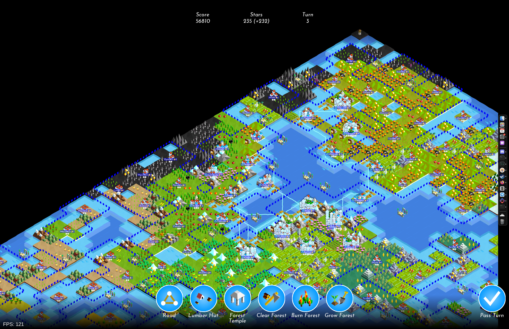

# Youtopia



A clone of "The Battle of Polytopia" with an emphasis on moddability.

> This is not an official Polytopia product. Not approved by or associated with Midjiwan.

## Current functionality

Single-player sandbox mode without troops and technologies.
Pretty much every tile action is supported.
Server-side mods are supported.

## Architecture and design

The app is split into two major parts: logical client and logical server.

### Client

The client is written with [LibGDX](https://libgdx.com/).
Client logic is located mostly in the `core` module.
`desktop`, `android` and `ios` modules contain platform-specific logic and depend on the `core` module.
The client is responsible for showing a picture to the player.
It doesn't know how the game works and can only change the presentation following simple commands from the server.

### Server

The server is represented by the multiplatform `server` module.
All the game logic is located inside the `jsMain` source set.
[Zipline](https://github.com/cashapp/zipline) is used to compile this code into a package of magic bytecode that is run by the embedded QuickJS engine.
This way parts of server logic can be replaced or overridden without recompiling the game.
This allows the modding system to function.

### Bridge

Communication between regular kotlin code and zipline bytecode is not easy.
All the information sent has to be serialized and deserialized.
This affects performance when done a lot, so the communication has to be efficient.
The server has a single facade called `Commands`.
This is the only way the communication with the server is done.
Some methods in it are used for mod synchronization and are not important for this section.
The others are used in client-server communication itself and will be listed here, as they are crucial for modding the game.

|                             |                                                                                                                                                                                                                                                                                                    |
|-----------------------------|----------------------------------------------------------------------------------------------------------------------------------------------------------------------------------------------------------------------------------------------------------------------------------------------------|
| requestAvailableTileActions | When the player selects a tile on the map some actions become available. These actions are called `TileAction`s.                                                                                                                                                                                   |
| performTileAction           | When a tile action is selected it has to be performed. The result of action execution (`ActionResult`) is a list of `GameEffect`s, a set of `RoadNetwork`s and a list of `CityUpgradeRewardRequest`s. `GameEffect`s are received on the client and rendered one by one, changing the presentation. |
| performGeneralAction        | The same as `performTileAction` but for actions not linked to a specific tile (e.g. passing the turn).                                                                                                                                                                                             |
| chooseCityUpgradeReward     | Similar to the two above. The action is performed when the player chooses a city upgrade reward.                                                                                                                                                                                                   |
| generateGame                | Used to generate the game on startup. Returns a `Game` instance.                                                                                                                                                                                                                                   |
| calculateGameDiff           | Calculates a `GameDiff` based on a `GameEffect`.                                                                                                                                                                                                                                                   |
|                             |                                                                                                                                                                                                                                                                                                    |

Server state consists of 3 components:
- `game` - a complete representation of the game.
- `roadNetworks` - a set of structures representing road networks in the game. They are used to speed up calculations that happen when a road is built or a port is removed.
- `cityUpgradeRequestQueue` - a queue of city upgrade requests that are waiting for a resolution by the player. Requests are put into the queue in the same order as corresponding city upgrade effects appear in the response of `performTileAction`. They are resolved by the client in the exact same order via `chooseCityUpgradeReward`.

These components are changed on the server when `performTileAction`, `performGeneralAction` or `chooseCityUpgradeReward` are performed.
The client, on the other hand, only receives a list of `GameEffect`s for each of these actions and renders the effects.

## Modding

> Modding API is unstable and **will** be changed in the future.

Mods are basically separate servers with parts of their functionality disabled.
When the client asks to execute a command, the command is first passed through all the modded servers, looking for the first one that can handle it. If no one is able, it is brought to the default server provided with the game.
`requestAvailableTileActions` is different in this regard: it starts with the default server, receives a list of available actions, and then goes through the mods in the reverse order, with each one having a chance to modify the list with the first mod having the final word.
(Mods are currently sorted by their name.)

In order to begin modding, download the example from here.
This mod allows the player to convert any land into forest for free.
Try building the mod by executing this gradle command:
```
./gradlew compileDevelopmentExecutableKotlinJsZipline
```
A folder called `Development` will appear under `server/build/zipline`, it will contain files of your mod.
You need to copy this folder into the MODS folder of the game.
Here is a breakdown of its location by platform:

|            |                                             |
|------------|---------------------------------------------|
| Windows    | AppData/Roaming/.qsr/Youtopia/MODS          |
| Android    | Android/data/org.youtopia/files/MODS        |
| MacOS      | Library/Application Support/Youtopia/MODS   |
| Linux      | *YOUR_LINUX_HOME*/.qsr/youtopia/MODS        |
| Windows XP | Application Data/Roaming/.qsr/Youtopia/MODS |
|            |                                             |

Try running the game. You will see the new tile action among the others.

When developing your mod, make sure to throw a `NotImplementedException` when you want to pass control to other mods.
Any other exception will be treated as an error in your code and will crash the game.

## Modules

- `core`: Logical client, main module with the application logic shared by all platforms.
- `desktop`: Primary desktop platform using LWJGL3.
- `android`: Android mobile platform. Needs Android SDK.
- `ios`: iOS mobile platform using RoboVM (not supported currently).
- `server`: Logical server written in Kotlin/JS. Needs to be compiled separately before it can be used.
- `shared`: Data classes shared between server and client.
- `server-runner`: A separate application for running a remote server (not supported currently).

## Gradle

- `Youtopia [compileDevelopmentExecutableKotlinJsZipline]`: compiles the server into zipline bytecode, which can be found at `server/build/zipline/Development`
- `Youtopia:desktop [run]`: starts the application on desktop.
- `Youtopia:desktop [jar]`: builds application's runnable jar, which can be found at `desktop/build/lib`.
- `android`: starts the application on Android.
- `Youtopia [detektAll]`: runs all detekt tasks.

## Contributing

Any contributions are welcome.
In order to build the game you first need to compile the server.
If you are testing on Android, make sure to copy the server into `assets/localServer`.
When testing on desktop set `DEV` in `runZipline` to `true` so you don't have to copy server files after each change.

## License

The images used in the game assets ([1](/assets/visuals.png) and [2](/assets/map_ui_visuals.png)) belong to Midjiwan AB.

Everything else is licensed under [GPLv3](/LICENSE.md).

